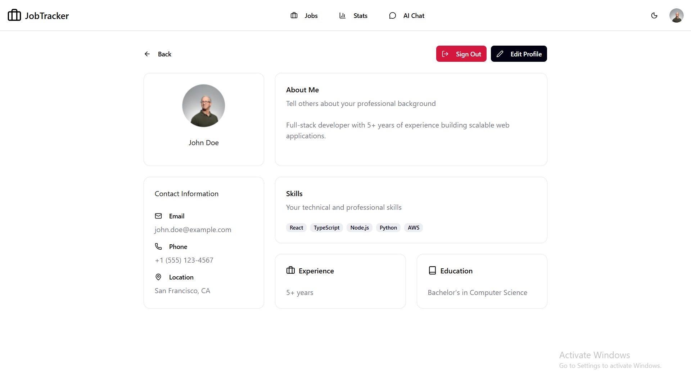

# 🎯 JobTracker

🚀 **[Live Demo](https://jobtracker-99.vercel.app)**  
🎨 **[Figma Design](https://www.figma.com/design/mpsBxlJ4se2CLcwh9es5M3/Untitled?node-id=6-8081t=4Ft2Ki0mUJchWY9Z-0)**

A modern, full-featured **job application tracking system** built entirely by me using **React, TypeScript, Tailwind CSS, Supabase**, and more.  
JobTracker helps users efficiently manage their job applications, track progress, and gain insights — all in one intuitive dashboard.

---

## 🛠 Tech Stack

- **React**
- **TypeScript**
- **Tailwind CSS**
- **React Router**
- **React Query**
- **Redux Toolkit**
- **React Hot Toast**
- **Recharts**
- **Lucide Icons**
- **Day.js**
- **Supabase**
- **React Markdown**
- **React Error Boundary**

---

## ✨ Features

### 🧭 Core Functionality

- Full authentication & authorization with Supabase
- CRUD operations for job applications
- Sort, filter, and search functionality
- State management with Redux Toolkit
- Data caching with React Query

### 📊 User Experience

- Interactive dashboard with job statistics
- AI-powered chatbot for better UX
- Notifications using React Hot Toast
- Dark mode toggle
- Error boundaries and error handling

### 👤 User Profile

- Edit or delete personal info
- Upload and update profile image
- Secure account management

### 📱 Responsive Pages

- Homepage
- Login & Signup pages
- Job Applications page
- Add Application page
- Single Application details page
- Stats page
- AI Chat page
- User Profile page

_All pages are fully responsive and optimized for all screen sizes._

---

## 🖼 Screenshots

### Homepage


### Login Page


### Applications Page


### Add Application Page


### Single Application Page


### Stats Page


### AI Chat Page


### User Profile Page



---

## 💻 Running Locally

To run this project locally, follow these steps:

```bash
# 1. Clone the repository and navigate into it
git clone https://github.com/your-username/JobTracker.git
cd JobTracker

# 2. Install dependencies
npm install      # or yarn install / pnpm install

# 3. Start the development server
npm run dev      # or yarn dev / pnpm dev

# 4. Open the app in your browser
# Default URL: http://localhost:5173/
```

---

## License

This project is licensed under the MIT License. See the [LICENSE](LICENSE) file for details.
