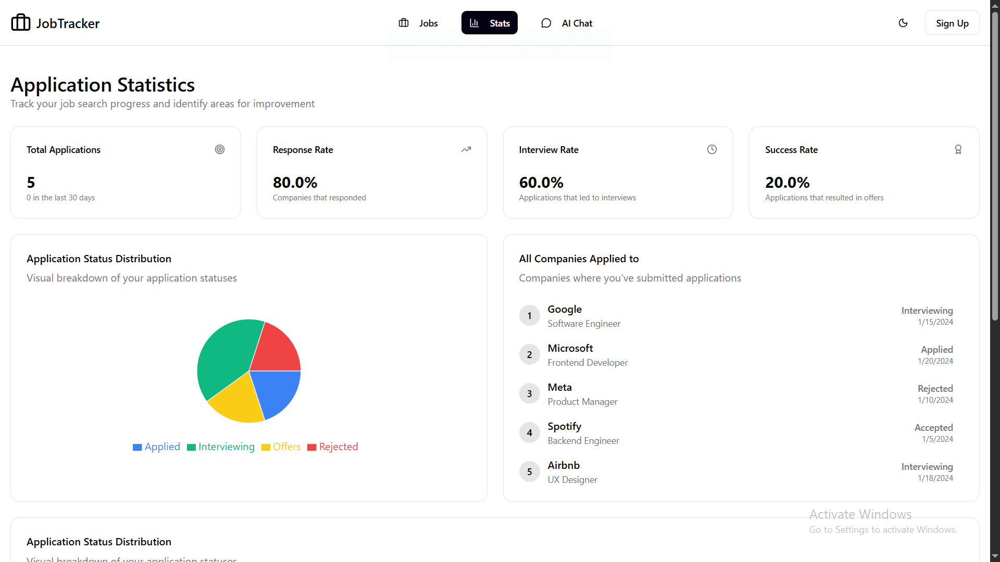

# JobTracker

A portfolio project for tracking a user's job applications with full Authentication, CRUD operations, and database support built completely by me using React, TypeScript, Tailwind, React Router, Supabase, and more.

---

## Tech Stack

- React
- TypeScript
- Tailwind CSS
- React Router
- React Query
- Redux
- React Toaster
- Recharts
- Lucide Icons
- Supabase

---

## Current Features

- Static homepage (fully responsive)
- Login page (fully responsive)
- Static applications page (fully responsive)
- Static new-application page (fully responsive)
- Static one-Application page (fully responsive)
- Static Stats page (fully responsive)

---

## Planned / Future Features

- Full authentication with Supabase
- CRUD operations for job applications
- User dashboard with job statistics
- Notifications using React Toaster
- User profile page (edit/delete personal info and profile image)
- AI chat bot for better UX
- State management with Redux

---

## Screenshots / Demo

### Homepage


### Login Page


### Applications Page


### New Applications Page


### Single Applications Page


### Stats Page



### AI Chat Page


---

## Running Locally

To run this project locally, follow these commands:

```bash
# 1. Clone the repository and navigate into it
git clone https://github.com/your-username/JobTracker.git
cd JobTracker

# 2. Install dependencies
npm install      # or yarn install / pnpm install

# 3. Start the development server
npm run dev      # or yarn dev / pnpm dev

# 4. Open the app in your browser
# Default URL: http://localhost:5173/
```

---

## License

This project is licensed under the MIT License. See the [LICENSE](LICENSE) file for details.
